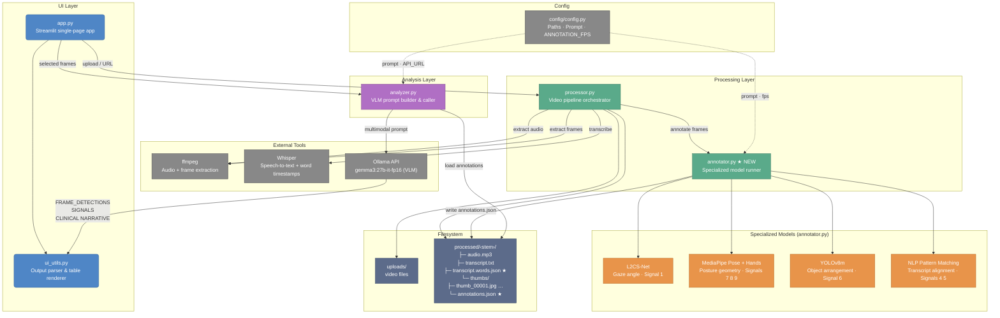
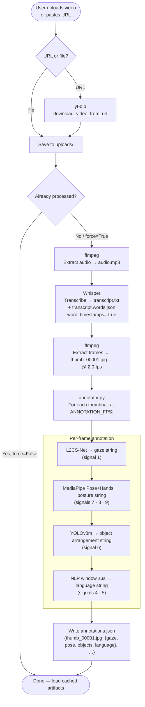
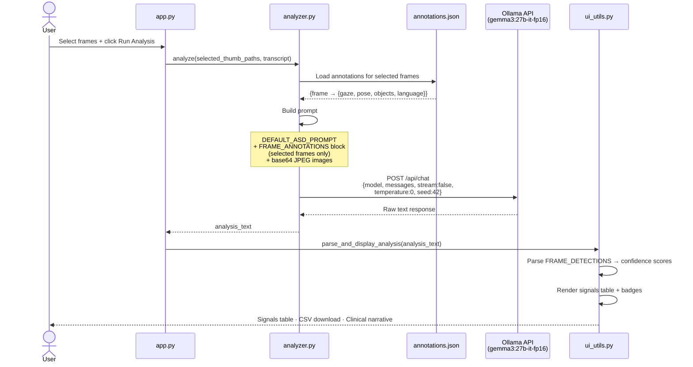
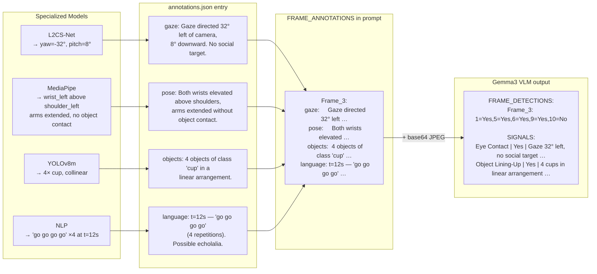

# ASD Video Analyzer — Architecture & Workflow Diagrams

---

## 1. System Architecture

---

## 2. Processing Pipeline (Video Ingestion)

Runs once per video. Idempotent — skips completed stages if output already exists.

---

## 3. Analysis Workflow (Single Run)

Triggered when the user selects frames and clicks **Run Analysis**.

---

## 4. Annotation → Prompt Mapping

How specialized model outputs become VLM input for a single frame.

